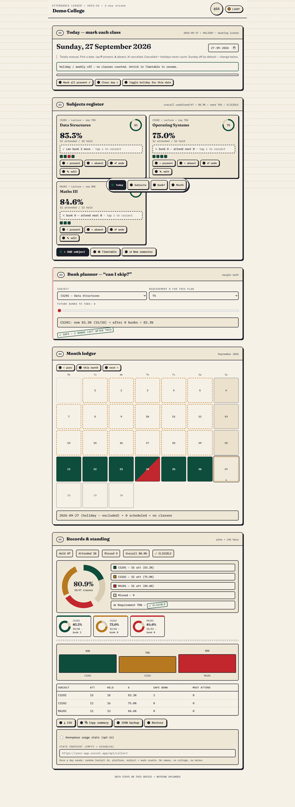
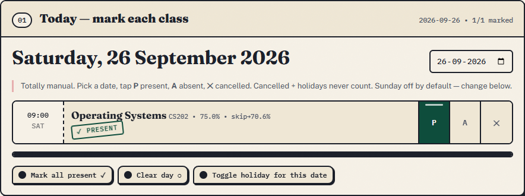
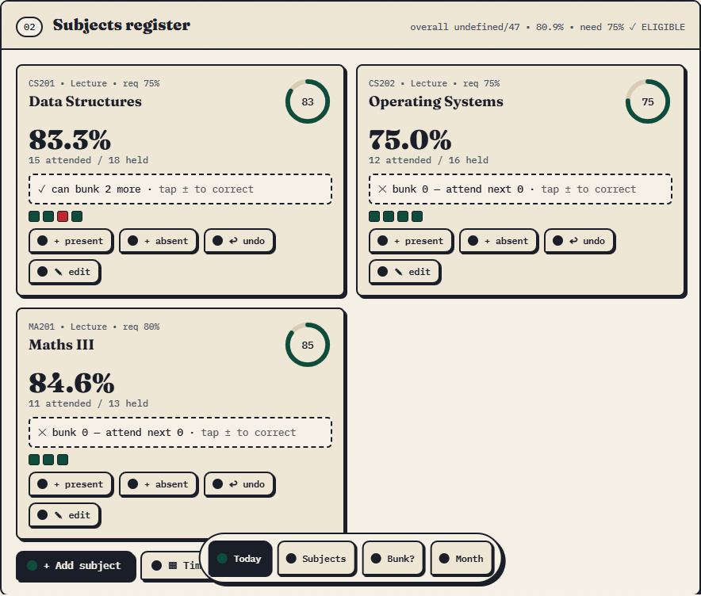
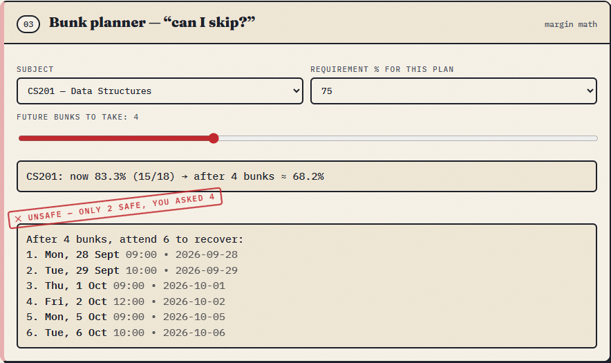
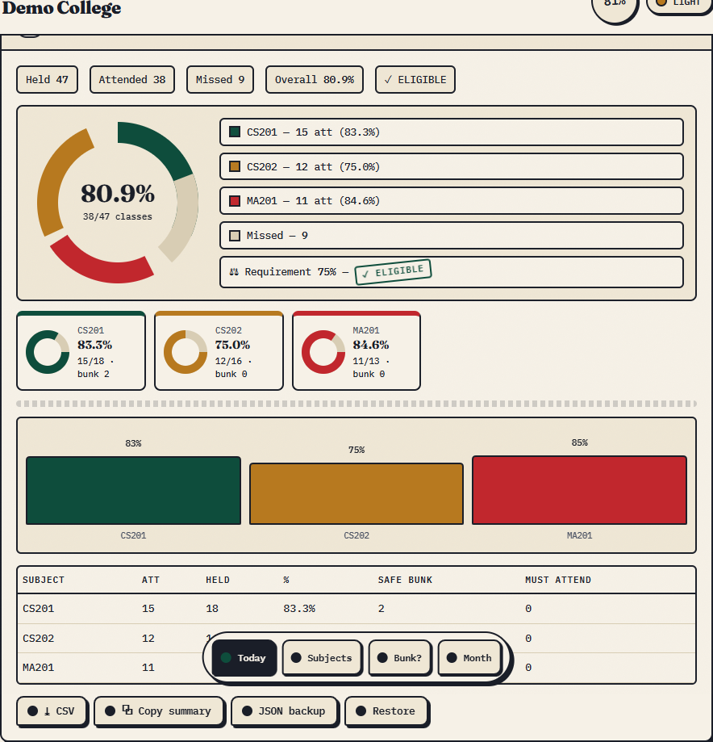
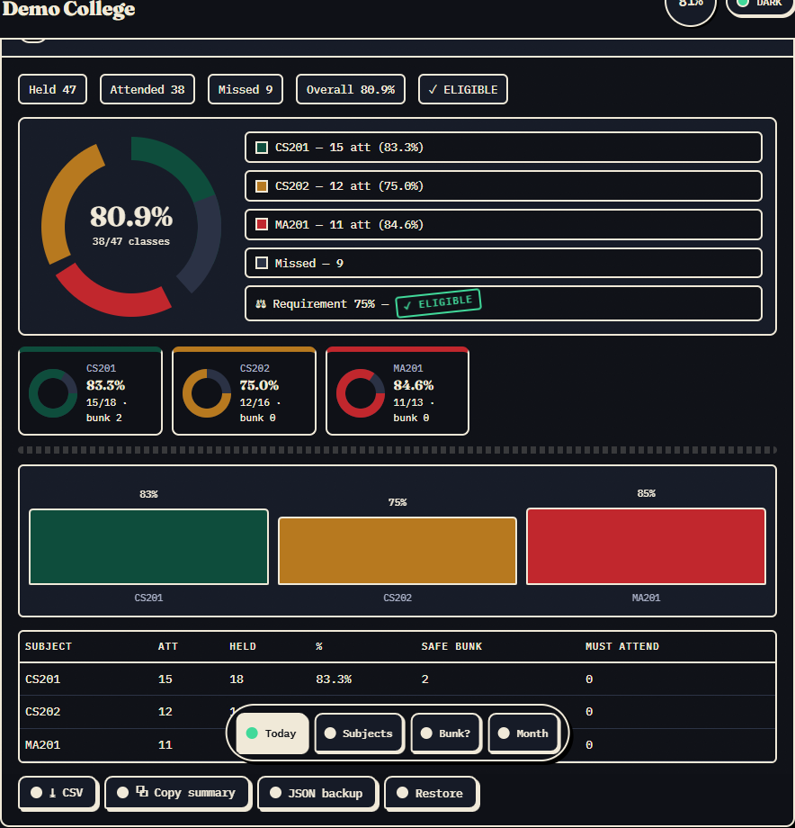
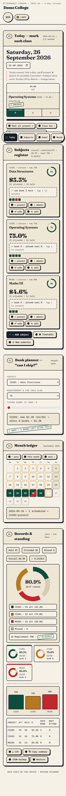

# Attendance Ledger

A single-file, offline-first **college attendance tracker + bunk planner**. No backend, no login, no build step — open `index.html` and it works. All data stays in your browser (`localStorage`).



[](https://vercel.com/new/clone?repository-url=https://github.com/shivanshdueby7/college-attendance-tracker) · **Live:** https://attendance-ledger-murex.vercel.app · **Android:** WebView APK (`com.attendance.ledger`, debug-signed)

## Screenshots

| Today — mark each class | Subjects register |
|---|---|
|  |  |

| Bunk planner — can I skip? | Records, pies + bars |
|---|---|
|  |  |

| Night-study dark theme | Mobile (390px) |
|---|---|
|  |  |

## Features

- **Manual per-day, per-class marking** — Present / Absent / Cancelled from a timetable-driven Today view. Cancelled classes, holidays and weekly offs never count.
- **Subjects register** — per-subject requirement % (65/75/80/85/custom), prior counts for mid-semester onboarding, credit/type tags.
- **Bunk engine** — safe-to-bunk and must-attend recovery counts per subject and overall:
  - above target: `safe = ⌊(present − r·total) / r⌋`
  - below target: `need = ⌈(r·total − present) / (1−r)⌉`
  - recovery lists the **actual upcoming class dates** from your timetable (holidays and days off skipped).
- **Month ledger** — calendar with honest day states: today ring, past-unmarked amber markers, future days never struck through, mixed present/absent split, cancelled-only and holiday treatments.
- **Records** — per-subject donut pies in distinct inks, overall share pie, bars, ledger table, streak counter, shortage alerts.
- **Planner simulator** — "bunk next N → projected %" with safe/unsafe verdict stamps.
- **Exports** — CSV (formula-injection safe), copy summary, JSON backup + validated restore.
- **Dark "night study" theme**, responsive down to 320px, keyboard-accessible, `prefers-reduced-motion` respected.

## Use

**Web (this repo):** open `index.html`, or deploy — it's static:

```bash
npx vercel --prod
```

**Android:** wrap `index.html` in the WebView shell (see commit history / `MainActivity` pattern: `file:///android_asset`, DOM storage on) and `assembleDebug`.

## Scale — ready for 1k–10k users

- **Reads scale free:** pure static file on Vercel's CDN. 10k users × ~70KB = ~700MB transfer — far inside free limits.
- **Writes stay on-device:** no shared database in the hot path, so concurrent users can't slow each other down. Worst case measured in headless Chrome (mobile viewport, 10,290 marks): full re-render **~157ms**, store 644KB — a real 4-year degree is <2k marks (<30ms).
- **Attack-tested:** 31-case battery (`tools/attack.js` in the build machine) covers stored-XSS payloads, malicious restores (`null`, prototype pollution, 20k-log dumps), CSV formula injection, fake dates, future-mark inflation — all passing against the real code.

## Admin stats (opt-in)

The app is offline-first, so global stats need a tiny backend. Included, zero new dependencies:

1. Create a free [Supabase](https://supabase.com) project → SQL editor → run `schema.sql`.
2. Vercel dashboard → this project → Environment Variables: `SUPABASE_URL`, `SUPABASE_SERVICE_KEY`, `ADMIN_TOKEN` (any long random string) → redeploy.
3. Open `admin.html` (deployed alongside the app), paste the stats URL + token → installs, active 7d/30d, platform split, recent table.
4. Each user opts in once: Records → *Anonymous usage stats* → tick + endpoint `https://<your-app>.vercel.app/api/collect`.

What leaves the device (once a day, only if the user opts in): random install id, platform, subject/mark counts. No names, no colleges, no dates — the admin IDs are truncated to 8 chars and there is no personal data to leak.

## Project structure

```
index.html      # the entire app — HTML + CSS + JS, no dependencies (fonts via CDN, degrade offline)
logo.png        # ledger-seal mark (also the Android launcher + favicon source)
vercel.json     # static hosting config
screenshots/    # README captures (generated with headless Chrome + seeded demo data)
```

## Privacy & security

- 100% client-side; zero network calls except Google Fonts (optional, falls back offline).
- Attendance data never leaves the device — no accounts, no analytics, no tracking.
- Imports validated on restore (schema, ID sanitisation, XSS-escaped rendering, CSV hardened).
- Safe to fork public: the repo contains no keys, tokens, or personal data.

## Tech

Vanilla HTML/CSS/JS in one file. No framework, no chart library (hand-rolled SVG rings/pies/bars), no build. Storage: versioned `localStorage` key `ledger_v1` with migration + validation.
